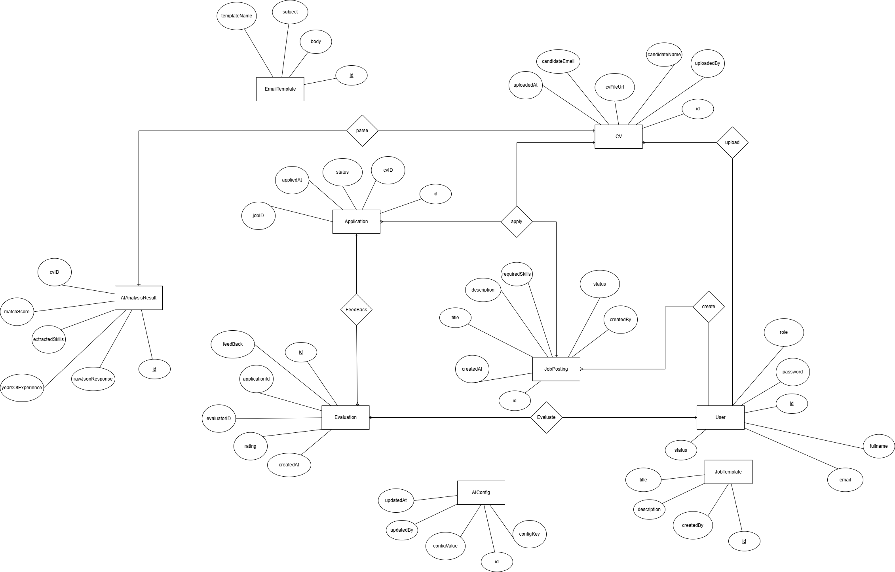

# Thiết Kế Cơ Sở Dữ Liệu (Database Design)

**Dự án:** 15 - AI Resume Screening System
**Hệ quản trị CSDL:** MySQL

---

## 1. Sơ đồ Thực thể - Liên kết (ERD)

---

## 2. Chi tiết Lược đồ CSDL (Database Schema)
Hệ thống bao gồm 8 bảng chính:
- User
- AIConfig
- JobTemplate
- EmailTemplate
- JobPosting
- Application
- AIAnalysisResult
- Evaluation

### 2.1. Bảng `User`
Lưu trữ thông tin tài khoản, phân quyền của Admin, Recruiter và Hiring Manager.

| Tên cột | Kiểu dữ liệu | Khóa | Ràng buộc | Thuộc tính ERD |
| :--- | :--- | :--- | :--- | :--- |
| `id` | INT | PK | AUTO_INCREMENT | id |
| `fullname` | VARCHAR(100) | | NOT NULL | fullname |
| `email` | VARCHAR(100) | | NOT NULL, UNIQUE| email |
| `password` | VARCHAR(255) | | NOT NULL | password |
| `role` | VARCHAR(20) | | NOT NULL | role |
| `status` | VARCHAR(20) | | DEFAULT 'ACTIVE'| status |

### 2.2. Bảng `AIConfig` (Cấu hình AI)
Lưu trữ các cấu hình và trọng số AI.

| Tên cột | Kiểu dữ liệu | Khóa | Ràng buộc | Thuộc tính ERD |
| :--- | :--- | :--- | :--- | :--- |
| `id` | INT | PK | AUTO_INCREMENT | id |
| `config_key` | VARCHAR(50) | | NOT NULL, UNIQUE| configKey |
| `config_value`| VARCHAR(255) | | NOT NULL | configValue |
| `updated_by` | INT | FK | -> User(id) | updatedBy |
| `updated_at` | TIMESTAMP | | | updatedAt |

### 2.3. Bảng `JobTemplate`
Lưu trữ các mẫu mô tả công việc (JD) do Admin tạo.

| Tên cột | Kiểu dữ liệu | Khóa | Ràng buộc | Thuộc tính ERD |
| :--- | :--- | :--- | :--- | :--- |
| `id` | INT | PK | AUTO_INCREMENT | id |
| `title` | VARCHAR(255) | | NOT NULL | title |
| `description` | TEXT | | NOT NULL | description |
| `created_by` | INT | FK | -> User(id) | createdBy |

### 2.4. Bảng `EmailTemplate`
Lưu trữ các mẫu email hệ thống.

| Tên cột | Kiểu dữ liệu | Khóa | Ràng buộc | Thuộc tính ERD |
| :--- | :--- | :--- | :--- | :--- |
| `id` | INT | PK | AUTO_INCREMENT | id |
| `template_name`|VARCHAR(100) | | NOT NULL | templateName |
| `subject` | VARCHAR(255) | | NOT NULL | subject |
| `body` | TEXT | | NOT NULL | body |

### 2.5. Bảng `JobPosting`
Quản lý các tin tuyển dụng thực tế do Recruiter đăng tải.

| Tên cột | Kiểu dữ liệu | Khóa | Ràng buộc | Thuộc tính ERD |
| :--- | :--- | :--- | :--- | :--- |
| `id` | INT | PK | AUTO_INCREMENT | id |
| `title` | VARCHAR(255) | | NOT NULL | title |
| `description` | TEXT | | NOT NULL | description |
| `required_skills`| TEXT | | | requiredSkills |
| `status` | VARCHAR(20) | | DEFAULT 'OPEN' | status |
| `created_at` | TIMESTAMP | | DEFAULT NOW() | createdAt |
| `created_by` | INT | FK | -> User(id) | createdBy |

### 2.6. Bảng `Application`
Lưu trữ thông tin hồ sơ ứng tuyển, file CV của ứng viên.

| Tên cột | Kiểu dữ liệu | Khóa | Ràng buộc | Thuộc tính ERD |
| :--- | :--- | :--- | :--- | :--- |
| `id` | INT | PK | AUTO_INCREMENT | id |
| `job_id` | INT | FK | -> Job_Posting(id)| jobId |
| `candidate_name`|VARCHAR(100) | | NOT NULL | candidateName |
| `candidate_email`|VARCHAR(100) | | NOT NULL | candidateEmail |
| `cv_file_url` | VARCHAR(255) | | NOT NULL | cvFileUrl |
| `status` | VARCHAR(20) | | DEFAULT 'PENDING'| status |
| `uploaded_at` | TIMESTAMP | | DEFAULT NOW() | uploadedAt |
| `uploaded_by` | INT | FK | -> User(id) | uploadedBy |

### 2.7. Bảng `AIAnalysisResult`
Lưu kết quả phân tích CV và điểm đánh giá từ hệ thống AI (OpenAI API).

| Tên cột | Kiểu dữ liệu | Khóa | Ràng buộc | Thuộc tính ERD |
| :--- | :--- | :--- | :--- | :--- |
| `id` | INT | PK | AUTO_INCREMENT | id |
| `application_id`| INT | FK | -> Application(id)| applicationId |
| `match_score` | DECIMAL(5,2) | | | matchScore |
| `extracted_skills`|TEXT | | | extractedSkills |
| `years_of_experience`| DECIMAL(4,1) | | | yearsOfExperience |
| `raw_json_response`| JSONB / TEXT| | | rawJsonResponse |

### 2.8. Bảng `Evaluation`
Lưu trữ đánh giá thủ công của Hiring Manager.

| Tên cột | Kiểu dữ liệu | Khóa | Ràng buộc | Thuộc tính ERD |
| :--- | :--- | :--- | :--- | :--- |
| `id` | INT | PK | AUTO_INCREMENT | id |
| `application_id`| INT | FK | -> Application(id)| applicationId |
| `evaluator_id` | INT | FK | -> User(id) | evalutionId (Hiring Manager)|
| `rating` | INT | | CHECK (1-5) | rating |
| `feedback` | TEXT | | | feedBack |
| `created_at` | TIMESTAMP | | DEFAULT NOW() | createdAt |

---

## 3. Các mối quan hệ (Relationships)

1. **User - JobPosting (Create):** Quan hệ **1-N**. Một nhà tuyển dụng có thể tạo nhiều tin tuyển dụng.
2. **JobPosting - Application (Apply):** Quan hệ **1-N**. Một vị trí tuyển dụng sẽ có nhiều hồ sơ ứng tuyển.
3. **Application - AIAnalysisResult (Analyse):** Quan hệ **1-1**. Mỗi CV ứng tuyển chỉ có một bản báo cáo phân tích AI duy nhất tương ứng.
4. **Application - Evaluation (Feedback):** Quan hệ **1-N**. Một hồ sơ ứng viên có thể nhận được các bản đánh giá từ nhiều vòng/nhiều người khác nhau.
5. **User - Evaluation (Evaluate):** Quan hệ **1-N**. Một Hiring Manager có thể tham gia đánh giá nhiều hồ sơ

8.
9.
10. .
