# Demo Giao diện Chuyên viên tuyển dụng (Recruiter)

## 1. Trang Dashboard tổng quan
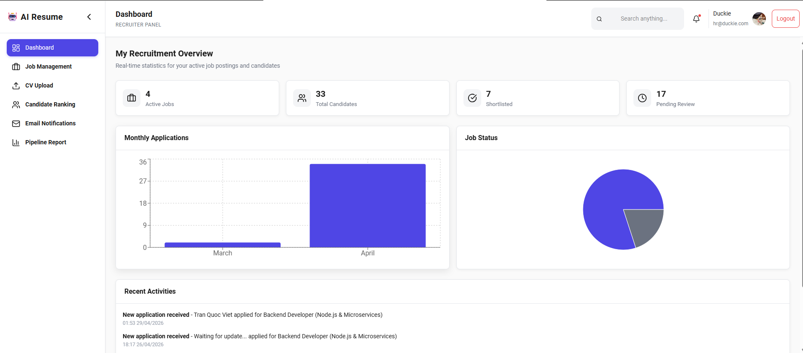

## 2. Trang Quản lý Job Posting (JD)
Danh sách Job Postings: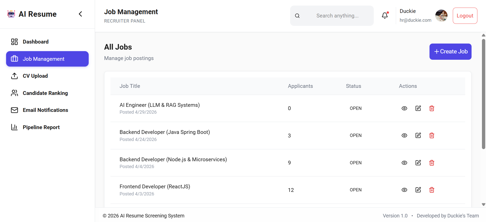
Tạo Job Posting mới: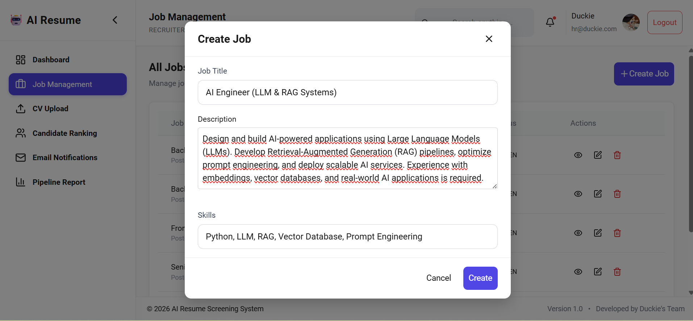
Xem chi tiết Job Posting: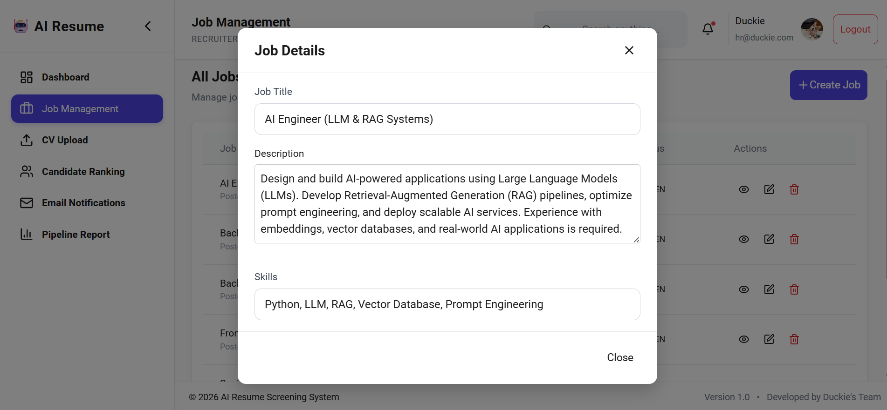
Chỉnh sửa Job Posting: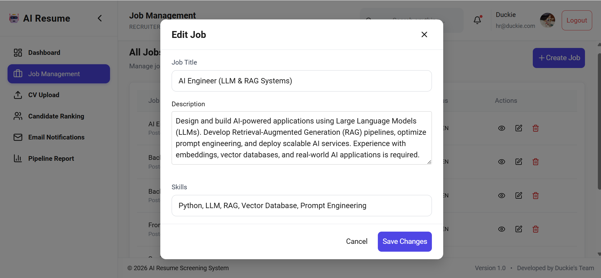

## 3. Trang Upload và chấm điểm CV
Upload CV lên hệ thống: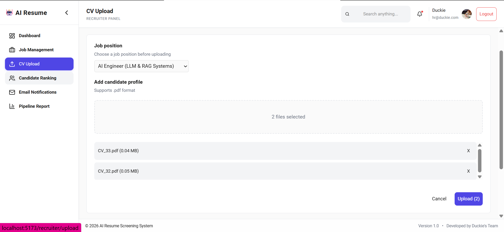
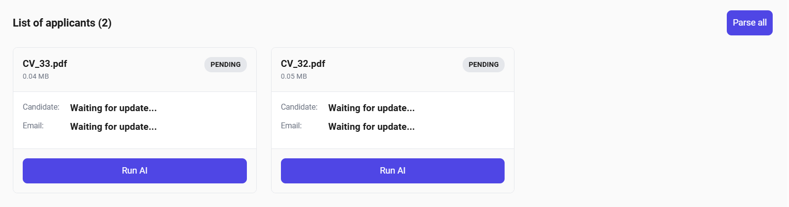
Parse và chấm điểm CV: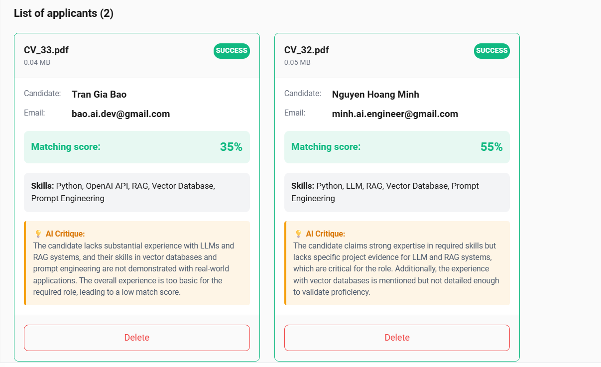

## 4. Trang Xếp hạng các ứng viên
Xếp hạng các ứng viên theo từng Job và thực hiện shortlist/reject ứng viên: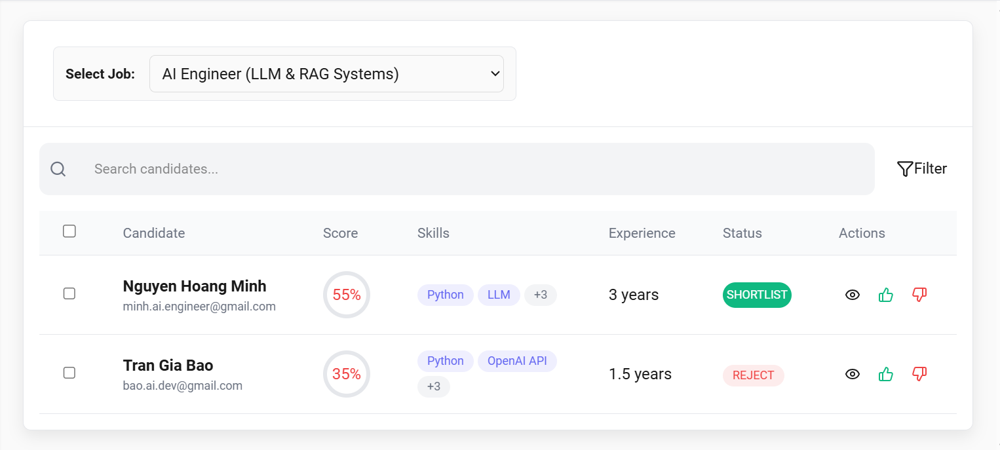

## 5. Trang Quản lý email
Chọn Template email và ứng viên để thực hiện gửi email: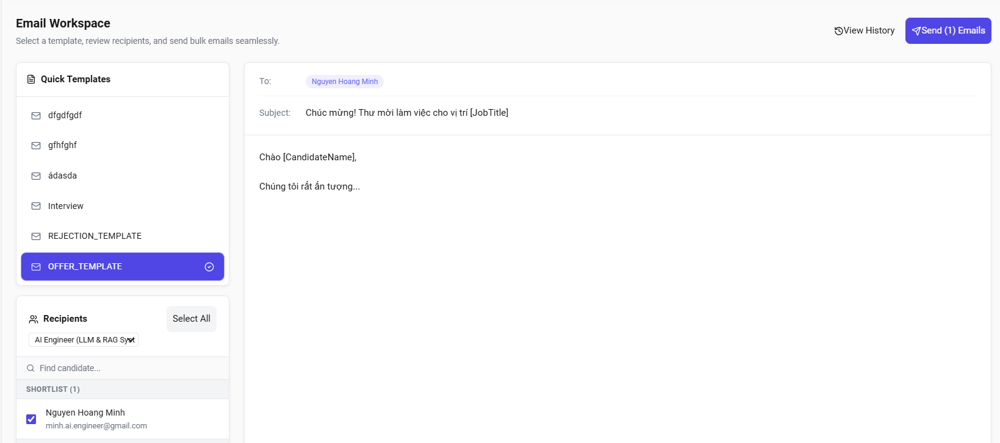
Xem lịch sử gửi email: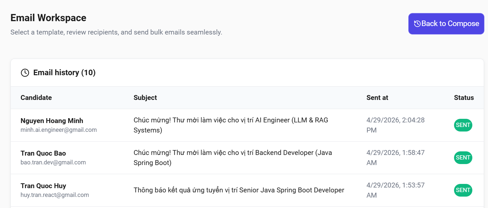

## 6. Trang Báo cáo dạng Pipeline
Thống kê tổng ứng viên theo status, tỷ lệ điểm và shortlist, biểu đồ thống kê skill theo Job: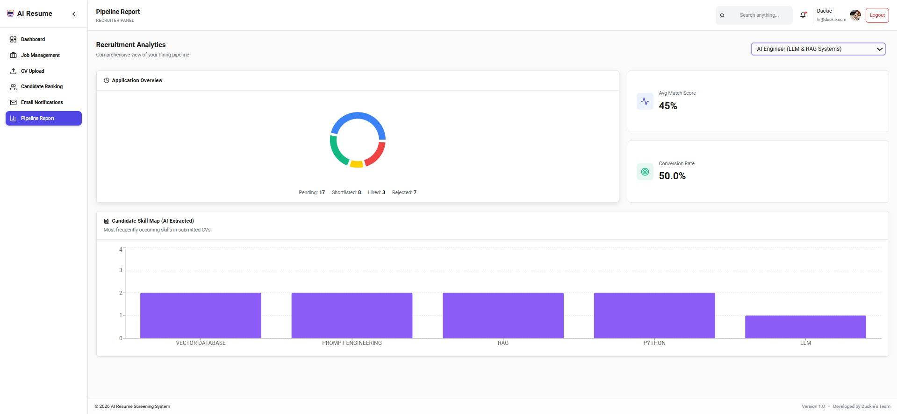